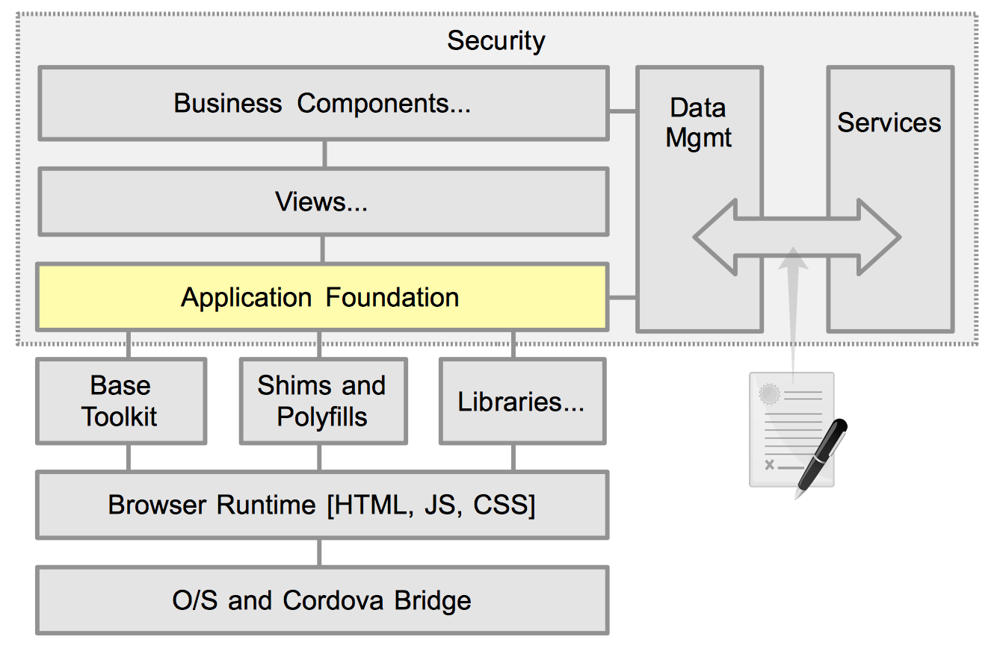
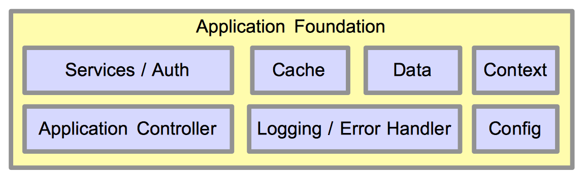

# Application Foundation



## Introduction

The Application Foundation consists of general purpose, reusable sub-systems. You can think of this as your "Monday morning solution", where it defines the general structure of your application. Developers come in and are instantly productive using a consistent toolkit set of API, and the functionality provided by the foundation.

The foundation is important to application architecture because you want to keep your application developers focused on creating the business logic specific to the application. They should not focus on the wiring and plumbing that required to hold everything together. If application developers are distracted by coding common boiler-plate logic, then bad things will happen. First, you loose consistency at the base of the application. Second, time spent not focusing on the unique business aspects of the app is time wasted.

The application foundation should be defined and developed by the senior developer. Hopefully, this foundation can be defined and reused across many different applications.

## Details and Sub-systems



The above image shows a representative breakdown of what could be included into the application framework. This is not meant to be an exhaustive example of possible foundation components. Each development environment, combined with specific toolkits and plugins will have their own unique needs.

### Application Controller

The application controller manages the application startup, initialization, and routing between views and actions. Several toolkits are now providing features that aid in app control. You may likely still need a custom wrapper to manage the library.

The app controller should manage:
- App initialization
- Loading configuration data
- Lazy loading of resources
- Routing and messaging between views

### Config

Dynamic runtime configuration of apps can be hugely valuable for developers, and general code reuse. Generally, anything that you might want to change at runtime, can and should be settable through a common configuration subsystem. One case in point is URLs. They frequently change during the development lifecycle, and should never be hard coded. By making service URLs dynamic, you can easily switch between environments with no code changes. Another use case for dynamic configuration is the ability to have a fixed configuration, typically defined in JSON for the app, and then have a server-side configuration that can be layered on top to provide specific settings on a per user or group role basis.

App developers should never have to make custom calls, or define their own special way of dealing with dynamic environments and settings. Keep it consistent across the entire app.

### Error Handling

As a general rule, application developers should **not** trap or handle error conditions. The only real exception to this rule is if there is a specific remedial action that can be applied to "expected" error conditions. Far too often, app developers spend a lot of time and effort trying to catch errors, report them to the user and then with nothing else to do, re-throwing the error up the line. This catch, report, pass along handling continues up the line. Do not even bother trying to catch errors if you cannot explicitly do something about it. Let the foundation handle that.  This way we get the following benefits:

- Cleaner application code as there are not constant try/catch blocks and false handling
- Improved overall performance. Try/Catch is expensive, and trying to locally manage errors just leads to code bloat
- Consistent error reporting to the user. there is a single place in the application to show either an error dialog, toaster message, or often time nothing at all.
- Ability to "phone-home" the error. Many apps will send the error info back to a service for analysis. Typically, when an error occurs, extra info is collected such as user details, browser environment, settings, etc, which is then bundled with the error details. Then (in theory at least), support personnel can analyze the error and pro-actively react, or at least generate a bug report.

An alternate to this all or nothing approach is to allow app developers to catch errors, and then report them through a common API. This enables the passing of extra details to the error handler. this can include local data details, source module and function, and so forth. Its still the error handlers responsibility to determine what to do with the error and how it should be managed, not buried within the app code itself.

The errors described above do not include "expected" errors. These are things like validating user input, such as "is it a properly formatted credit card number", or business logic like "attempting to transfer more than available funds". These types of expected errors should be handled locally with standard business rules.

### Data / Context / Cache

See [Data Management](./data-management.html)


### Services and Auth

Continuing along the Data access path comes a Services layer. This is another abstraction that should be employed in well designed apps. Just as the app dev should not worry about how the data is obtained, the Data context should likewise be ignorant of where remote data is sourced. The data context knows when it needs to make a remote service call, but is it really its concern if that service call is a RESTful action (GET/POST/PUT, etc), or an RPC call, or JSONP?  So this allows the context layer to make a just do a

	service.call("getAccountList", {id:1}).then( this.processAccountList );

As you can see, there is no knowledge of how the data is obtained, no error handling, authentication verification, envelope extraction, or custom settings for the remote service call. The service layer handles it all. Within the configuration layer, the various services can be defined like the following:

```JavaScript
	{
		"services" : {
			"service" : {
				"getAccountList" : {
					"type" : "GET",
					"url"  : "${urlBase}/clients/${id}/accounts",
					"options" : {
						timeout : 45
					}
				}
			}
			"options" : {
				"timeout"  : 30,
				"handleAs" : "json",
				"retries"  : 2
			},
			"settings" : {
				"urlBase" : "https://myhost.com:9001/services"
			}
		}
	}
```

You should be able to infer the general meaning of this configuration. The basic goal to ensure that the gory details of consuming services is abstracted away from the business and data management logic.

Another perfect facet for handling by the service layer is authentication. This might be handled by supplying the user's credentials on each service call. Or, in the case of a general sessions, a service call might return a 401 (UNAUTHORIZED) status response indicating that we are no longer authenticated. The service layer can handle this either automatically by sending in a call to re-login, or we can pop up a login dialog to the user. But, the point is that we do not lose the flow of intent of the request. The original caller will still get its data response. Now imaging this scenario without a service layer. Every single module thats making services calls would have to account for the 401 error (and all the other possible non-success status codes), go off to the authentication modules, possibly come back, and then have some convoluted retry logic. Its horribly messy, and I've seen it repeated countless times in countless client engagements. A simple abstraction solves all of these issues in a clean and reusable pattern.

# Summary

This section has stressed the need to have a strong and well designed application foundation.  Do not allow application developers write inconsistent boiler-plate code. Abstract anything ugly and potentially brittle into well written, tested, and battle hardened libraries that can be reused in all of your apps.


