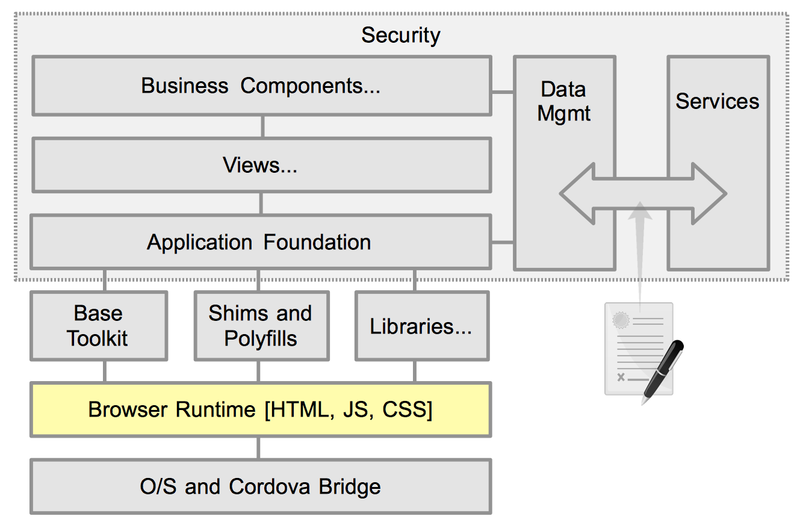

# Application Architecture

## Introduction

HTML5 was supposed to be the great unifier. Someday, we may actually get there, but today there is a still a very real issue with different browsers support of the standards. Developers will always want to use the latest and greatest solutions available. But, if you don't control the targeted runtime, which is the norm, then its best to base to the lowest common denominator. Wait, that was ten years ago! Today we have several options to mitigate browser variances. While the browser support of standards may still create a large gap, the developer's and users do not need to suffer. Using shims and polyfills, described next, along with base JavaScript toolkits, developers are enabled to code to the latest and hottest features, with minimal concern of the eventual runtime browser.

For mobile web apps, the biggest concern is constrained CPU and memory. While you can still provide a compelling mobile experience to your users, e aware of your environment's limitations.  We discuss this more in the developer's and performance best practices.

The take away form here is that while the browser is important, being the engine that drives your web app, smart abstraction removes almost all of the idiosyncrasies between various browsers. Testing of the app now becomes more important. Test advanced technologies early and often throughout the development life-cycle.

## References
- [EcmaScript5 Compatibility ](http://kangax.github.io/es5-compat-table/)
