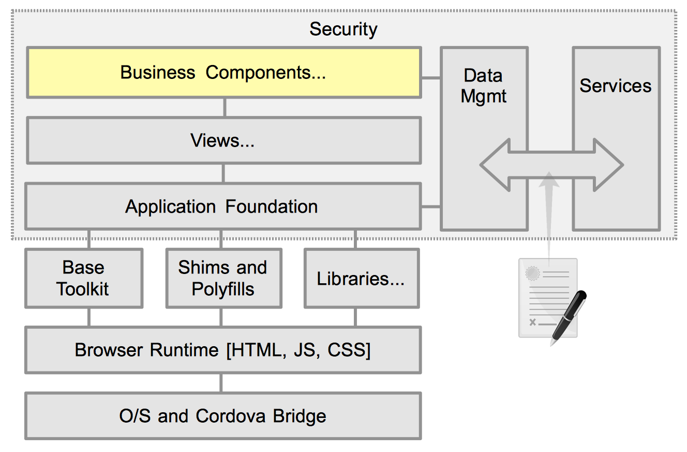
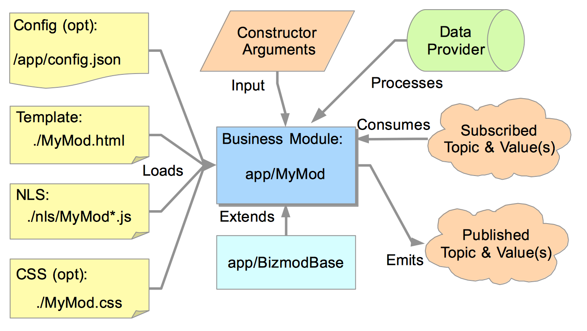

# Business Components

## Introduction

A Business Component (bizcomp) is a self contained unit of work. It is focused on solving a specific business focused concern, such as an "AccountList". Bizcomps can either be stand alone, or be a composite of other children bizcomps. As an example, a "VacationReservation" bizcomp could contain several children bizcomps such as; LocationLookup, RoomViewer, AvailableDatesSelector, and ProcessTrip. The contents of a bizcomp will typically consist of business logic and data access. If it has visual user interaction then there will be widgets and event handlers.

You can think of a bizcomp as a specialized black box that can act as its own mini-application. It has no knowledge of its external environment, having a fixed set of inputs, and publishes state changes for any consumer. It should be capable of standing on its own without any fixed dependencies on its environment or state of an outer (parent) bizcomp or the master app itself. This makes testing of bizcomps quite easy, either through simple unit tests, or through stand-alone exercising.

## Component breakdown

A bizcomp is a conceptual encapsulation of a fixed set of assets. Its implementation consists of an instantiatable Class module, zero or more dependent assets and input and outputs.

Typically, a bizcomp consists of a JavaScript controller and an HTML template. A base class may be utilized to provide a uniform API or other application dependent functions. It may optionally support a custom Style sheet, NLS, and runtime configuration. For input it takes constructor arguments, and may listen for published topics to react to.  As part of its buisiness logic, it will typically access a [data management](./data-management.html) layer. Finally, once its finished its own local user story, the bizcomp publishes its results to be handled by either its [containing view](./views.html), or the [application's router](./app-foundation.html#router).

