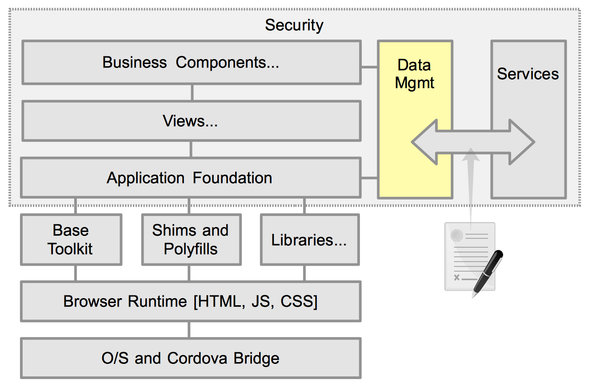

# Data Management



## Introduction

Proper handling of data is crucial to a well designed application. App developers should never make direct service calls for several reasons as described below. Its really not the app devs concern where a needed data set comes from. She just need to display a list of transactions, or save an entered form. The "how" muddies the waters. Treating all data as an abstract model maintains clean business code, and provides a consistent flow of data. Making a call to `AccountContext.getTransactionList()` is much cleaner than checking cache for a local copy, then making an AJAX call to obtain the data, then formatting the results, and finally passing the list to to a widget for display. The above actions still need to happen, but it shouldn't be done within the scope of the business logic.

The Data Management (also known as Context) layer is responsible for massaging raw data into a usable form, determining if it should be cached locally (either in memory, or persisting to storage), and potentially if there are any access control restrictions on using specific data sets or fields, based on user role.

Along with this context abstraction, there is a services abstraction described in [Application Foundation](./app-foundation.html#services-and-auth).

## Data Structures

Depending on your needs and the nature of the data, you can provide data in various ways.

- **Raw Objects** - This is the most basic way to provide data in JavaScript. members are access using direct dot notation (ex `customer.firstName`). If its a list of items, it is contained as an array that can be iterated. For pure custom code this is often the simplest approach.

- **Data Models** - If you need more structure, or added logic, then a data model is more appropriate. Internally, the data is stored in its raw for, but a public API is provided to the consumer. This is typically defined as accessors (getters) and mutators (setters) (eg `client.get("name")` or `client.getName()`). Using an API wrapper allows for

	- Manipulation of the raw data prior to its being returned. This can be in the form of compounding:

		```js
			getFullName() { return this._data.firstName + " " + this._data.lastName; }
		```

	- Adding Localized or other custom formatting:

		```js
			getAmount() { return this._convertToCurrency( this._data.amount ); }
		```

	- Persistence of altered data. This can be either through a micro service call, a dirty cache to be check pointed as a transaction, or any other custom routine.

- **Data Store** - For data sets or lists, many libraries provide a concept of Data Stores, that provide various access, mutation, sorting, and querying capabilities. This is an extension to the data model api, and is frequently used to drive visual widgets such as grid, trees, selectors, etc.


