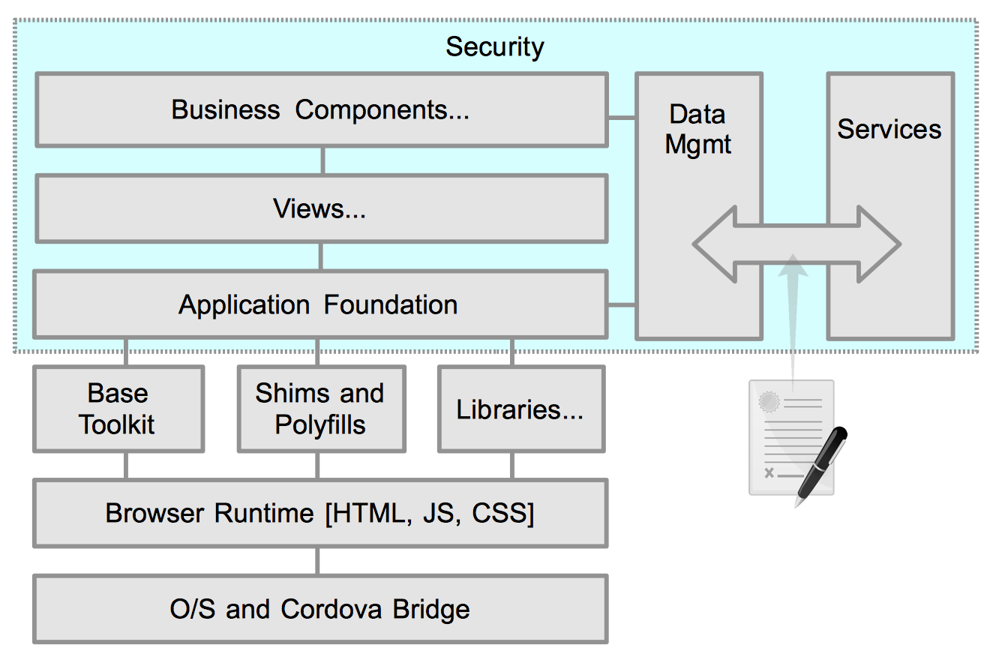

# Security

## Introduction

Covers many facets

- User authentication and authorization
- Sensitive / Proprietary code should be protected and hidden as services

## Coding
- MUST review all use of eval().
	- Eval'd expression must be from trusted source to avoid security vulnerabilities.
- MUST ensure no hard coded usernames or passwords in client processed code.
- MUST ensure no passwords are persisted in localStorage/sessionStoreage/Cookies
- SHOULD ensure no usernames are persisted in localStorage/sessionStoreage/Cookies

- Code scanning with App Scan

## Services
- Trust nothing coming in from requesters
	- Validate all parameters
	- Verify user on each call
- Database access
	- Prevent SQL Injection by using prepared procedures
	- Never use string concatenation for SQL queries
- Firewalls should be employed to limit access to servers
- Scanning tools

