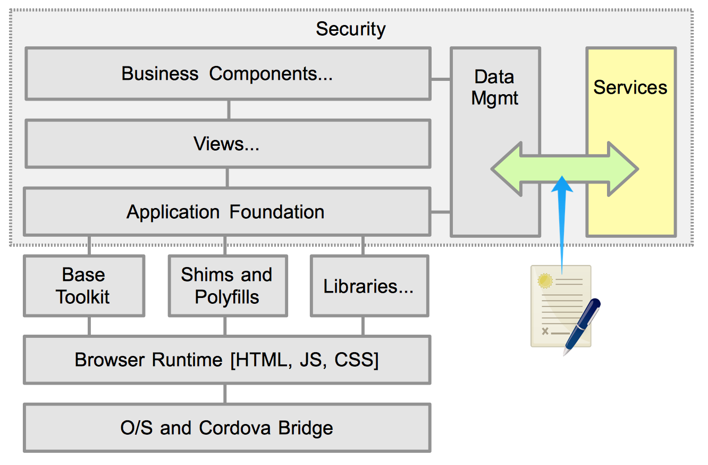

# Services

## Introduction

Services as how apps get and set data to a back-end host. This is a complex demarcation point for most apps, and significant care should be used at the beginning of every project to ensure its done right.  Far too often, services are defined ad-hoc as the project moves along and becomes a weak point in the entire application.  Let's not let that happen.

The front-end should not care at all about how the back-end services are implemented. As far as it is concerned, we have a URL (access target), parameters (modifiers), and a response payload. If the data is built using 100 monkeys typing the response in real time, so be it. Let's just hope they type fast!

Conversely, the back-end should not care who its consumers are. Its providing services that front incredibly complex back-end processes. They may be consumed by apps, other services, or aliens. Its not the back-end's concern. The only real important factor is that the consumer has appropriate authorization to access each service.  Considerate service providers may offer multiple access patterns (eg REST, RPC, JSONP), and payload structures (eg JSON or XML). Aliens prefer XML apparently.

## Service Types

If you are very lucky, you are working on a green field project where you get to define everything included in the services layer. You can dictate the access patterns (eg REST vs RPC), payload structure (eg JSON or XML), content and so forth.  Often times this is not the case, and the available services are already defined and are immutable.

If you do not have any control of how the services are provided, then it might make sense to define own services that act as facades to the real services. This gives you control of authentication and access control, transcoding of the data, caching, compounding different services, and so forth. The extra overhead of having a fronting service can far outweigh the effort involved performing these actions on the front-end. Give the front-end what it needs to for the app. The more data manipulation done on the front-end is wasted effort that takes away from presenting the data information to user and performing the desired business functions. For the paranoid, remember that anything on the front-end is insecure and can be inspected by anyone interested. Don't air your dirty laundry (data) for all to see.

Services should attempt to provide ways to limit the amount of information returned. We don't want to provide services that are too fine grained (one record at a time), or too course grained (all records). If there is a service to get transactions, we want to be able to gate the response to a fixed time period, number of records, and/or search pattern. We also don't want to have to make repeated calls to get a full data set. Its no fun having to make 12 calls to a "get transactions by month", to be able to show the user 12 months of sortable information.

## Services Contract

Since there is such a clean line between the front-end and the back-end, it is recommended that they be controlled by physically different, and hopefully separate development teams. If a single developer is designing and coding how the data is consumed and served, then things get murky and the end result is often a poorly designed interface that is *not* reusable and mixes concerns between both sides. This goes back to the back-end providing services to any consumer, and the front-end consuming data that it needs with minimal effort.

For a well managed and successful project, there **MUST** be a services contract defined. This is not optional. Insist that this occurs as early in the development process as practical. No exceptions.

The contract defines what services are available. For each service, the following entities are described:

- **Access pattern** - How it is called. This will typically be a RESTful URI, RPC procedure definition, or similar. It does not include the actual host that provides the services
- **Parameters** - What arguments are available to effect the results. Each parameter must have allowed values, constraints or other limits. Are any parameters required, or are they optional?

- **Response Definition** - How the response is structured. What structure, fields and data values does it contain. What elements are fixed, and what are optional. Is the data pre-formmatted, or does it have any special encoding. It shouldn't, but sometimes you get what you get. But we must know exact definitions of what is to be returned.

- **Errors, Status Codes, and Envelopes** - For RESTful services, status codes are typically used to define if the request worked. What status codes can be expected and is there any remediation that can be performed. Other times, such as SOAP based services, there may be a fixed envelop that describes the response itself. Define this so that consumers can pick out any useful information as well as the body of data itself.

Note: Error responses are a common failure point above and beyond the actual error. If the consumer is expecting a JSON response, and receives a Text or XML based error response, there is likely to be a local error even trying to parse the response. Always return the expected format, even in the case of error conditions.

- **Access Controls** - What sort of authentication and authorization restrictions limit access to this service?

