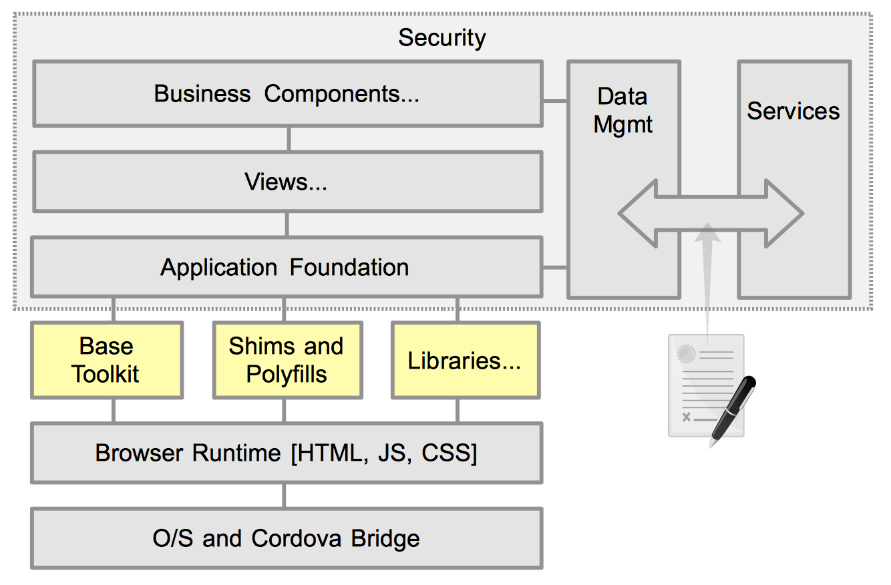

# Toolkits, Shims and Polyfills, and Libraries

## Introduction

Apps and JavaScript libraries can built by combining many possible combinations of existing and emerging open source tools…

We are lumping several topics into this area as the lines blur quickly when discussing this layer of the architecture. Effectively, any web app will utilize a base JavaScript toolkit from which to build on top of. Then, you may opt to utilize Shims and Polyfills to provide advanced technologies that are not consistently standardized on within browsers. Finally, one or more extra specialized libraries may be used to add additional feature above what is provided in the base toolkit.

Please refer to the [Libraries](../libraries/) section for details on the various toolkits and libraries.

## Base Toolkit(s)

The best advice that can be given is "Why reinvent the wheel, when so many others have already done it for you."  There is a wealth of JavaScript toolkits that can have an enormous impact on the quality of your app. In fact it is unheard of to attempt any medium to large scale Web app without utilizing a base toolkit. The base toolkit provides a generalized JavaScript environment and consistent API. Typically, your company will standardize on a single base toolkit to use in Web apps. As standards advance, a lot of functionality of toolkits should diminish. We still feel there will always be a place for quality toolkits to reduce boilerplate code and general application scaffolding.

## Shims and Polyfills

Those that take developing modern web apps seriously watch the new emerging technologies with a bit of melancholia. On one hand you have these really cool and exciting new technologies. But, on the other hand, you know it will 5-10 years before the majority of your user's browsers will be expected to support them. Things are beginning to look up though. Browsers are updated much more frequently than in the past, with forced upgrades. Also, many JavaScript toolkits provide shims to provide a facade for differences in API's and implementation to ensure consistent browser behavior.

Polyfills are a way to enable discreet JavaScript to enhance browsers that lake native functionality of the newest features and standards.

Common Polyfill / Shim libraries include:

- Google's [Polymer](../libraries/polymer.html)
- [Modrnizer](../libraries/)
