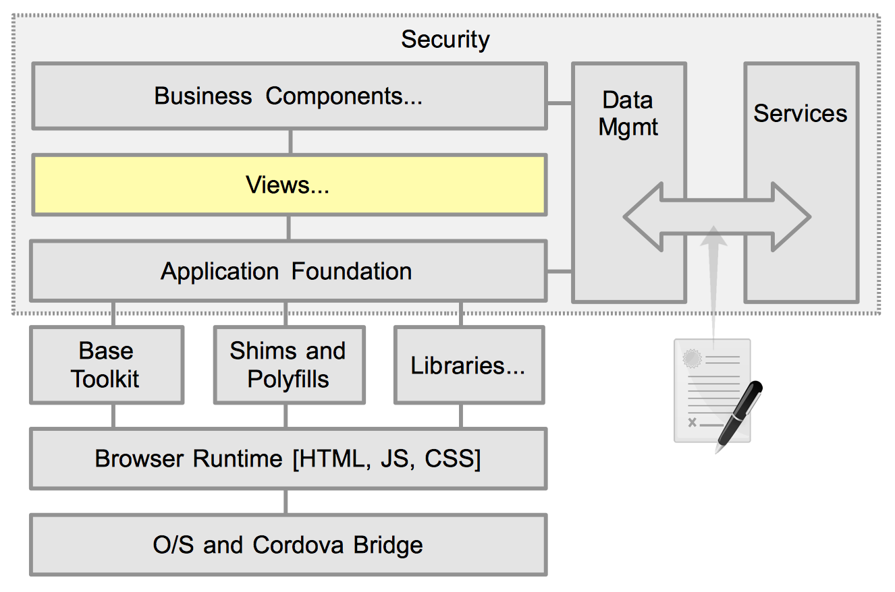

# Views

## Introduction

Almost all single page apps consist of a collection of "views". These views may consume the entire browser window in phones, or may be shown within panels of a complex layout. These views often represent a specific application story (eg book a trip), and should be responsive to resize or orientation changes. The view itself will rarely if ever have any business logic contained within it. It is simply the container hat can be shown or hidden based on navigation.

A view contains one or more [business components (bizcomps)](./buisness-components.html). The views acts as the mediator between the router -- that controls when transitions occur between views -- and the business components. The view may receive a transition message from the router, that may have originated from the previous view, one of its business components, or the router itself.

The target view instantiates its children bizcomps, passing in any targeted messages and possibly other environment specific setting that are unique to that view, as constructor arguments. The view may also manage "local" messaging between the bizcomps.

