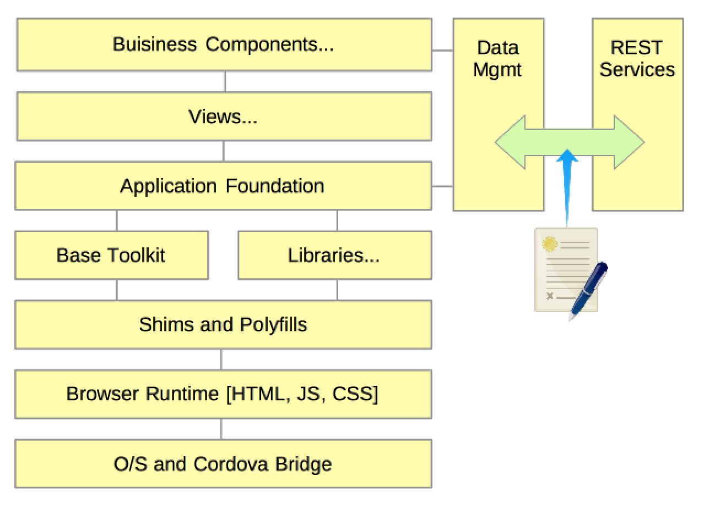

# Application Architecture

## Introduction

This document details the best practices when designing modern desktop and mobile single page apps (SPAs). It is critical to have a well thought out architecture at the client tier. Far too often, large enterprise applications employ architects to design and define he overall topology, and server-side interactions. Then when it comes to the client -- where in modern apps where the majority of business logic, 100% of the user interaction and a large part of the data processing occurs -- it is entirely represented by a simple browser icon.  The client tier must be analyzed and broken down into its logical components. There are several different layers of functionality that impact SPAs, as shown in the following figure.

In this section we will break down the various areas of the client tier and describe the importance of each area, and how to utilize each to ensure a high quality and performant solution.

## O/S and Cordova Bridge
Typically you will have little to no control the operating system your app is running upon. For desktop apps, this is rarely a concern. But today's "mobile-first" approach to application design and runtime operation, the O/S becomes central to how the app looks and behaves, and interaction with the hardware itself.

Mobile applications frequently mimic the operating system's look and feel. Also known as its theme, it relies on provided style guidelines to achieve a consistent user experience. Other aspects of O/S specific behavior is the existence of a back button, options access, and if the app can be safely placed into the background. Various toolkits, such as Dojox/Mobile, can provide the desired theming, and assist with application navigation and menuing behavior.

Apache's [Cordova](http://cordova.apache.org/) is a runtime library that provides a bridge between the application and various hardware resources like the camera, recorders, or the file system. Cordova is a comprehensive library exposed as Javacript API's, that internally makes HTTP calls to a local service handler that then uses native compiled code to interface directly with the devices hardware. There are several dozen plugins for Cordova that extend the base APIs. Utilizing these plugins extend access to features like Bar Code Scanning, augmented reality, and more. If you should ever find your self in need of native access features not provided by Cordova or one of its plugins, then you can write your plugin, using the O/S's native programming language, Java for Android and Blackberry, or Objective-C for IOS.  These are not just a mobile solution. Using the same topology, Cordova provides opportunities to turn any SPA's into stand-alone applications for desktop O/S's as well.

## Browser Runtime
HTML5 was supposed to be the great unifier. Someday, we may actually get there, but today there is a still a very real issue with different browsers support of the standards. Developers will always want to use the latest and greatest solutions available. But, if you don't control the targeted runtime, which is the norm, then its best to base to the lowest common denominator. Wait, that was ten years ago! Today we have several options to mitigate browser variances. While the browser support of standards may still create a large gap, the developer's and users do not need to suffer. Using shims and polyfills, described next, along with base JavaScript toolkits, developers are enabled to code to the latest and hottest features, with minimal concern of the eventual runtime browser.

For mobile web apps, the biggest concern is constrained CPU and memory. While you can still provide a compelling mobile experience to your users, e aware of your environment's limitations.  We discuss this more in the developer's and performance best practices.

The take away form here is that while the browser is important, being the engine that drives your web app, smart abstraction removes almost all of the idiosyncrasies between various browsers. Testing of the app now becomes more important. Test advanced technologies early and often throughout the development life-cycle.

## Shims and Polyfills
Those that take developing modern web apps seriously watch the new emerging technologies with a bit of melancolie. On one hand you have these really cool and exciting new technologies. But, on the other hand, you know it will 5-10 years before the majority of your user's browsers will be expected to support them. Things are beginning to look up though. Browsers are updated much more frequently than in the past, with forced upgrades. Also, many JavaScript toolkits provide shims to provide a facade for differences in API's and implementation to ensure consistent browser behavior.

Polyfills are a way to enable discreet JavaScript to enhance browsers that lake native functionality of the newest features and standards. Google's [Polymer](http://www.polymer-project.org/) is a new platform that aims to bring tomorrow's standards onto current platforms. If a given feature is not natively available on the user's browser Polymer will fills the gap through provided its provided library. While there may be a slight performance hit when non-native, the end goal is there for you to exploit. The ground covered by Polymer is extensive and too involved to describe in this document. But you are encouraged to get into Polymer and see what it has to offer your apps.

Using Polymer, and possibly other shim and polyfill libraries, you can develop cool apps using the latest emerging technologies. Never force users to deal with Web apps that look and feel like they were developed in the previous decade. The future is now (well, at least very soon!). Exploit it.

## Base Toolkit(s)
The best advice that can be given is "Why reinvent the wheel, when so many others have already done it for you."  There is a wealth of JavaScript toolkits that can have an enormous impact on the quality of your app. In fact it is unheard of to attempt any medium to large scale Web app without utilizing a base toolkit. The most popular general purpose toolkit is [JQuery](http://jquery.com/). JQuery, long with literally dozens of similar toolkits provide a rich API for developing web apps. Other more specialized toolkits focus on specific requirements of an app. In the following section, we'll list general areas, and what we think are the top toolkit providers. We wont recommend specific toolkits, as we'll that to you to find solutions that work for you and your projects requirements.

As standards advance, a lot of functionality of toolkits will diminish.  We still feel there will always be a place for quality toolkits to reduce boilerplate code and general application scaffolding.

### General purpose Toolkits
The following toolkits are focused on providing a robust platform for developing web applications.
- [JQuery](http://jquery.com/), [JQuery Mobile](http://jquerymobile.com/) - These are the de facto standards in JavaScript toolkits. There are an overwhelming number of extensions available to extend JQ's functionality. JQ is known for being easy to learn, but may have scalability concerns for larger projects.
- [Dojo Toolkit](https://dojotoolkit.org/) - Dojo provides a comprehensive environment for large scale web apps. It does have a larger learning curve, but has proven to be a scalable and flexible environment for large enterprise grade web apps.
-

### MVC
- [Backbone.js](http://backbonejs.org/)
- [Ember](http://emberjs.com/)
- [AngularJS](http://angularjs.org/)
- [KnockoutJS](http://knockoutjs.com/)
- [ExtJS](http://www.sencha.com/products/extjs/) - Sencha's entry.

### Application Foundation

### Views

### Business Components
A Business Component is a self contained unit of work. You can think of it as a specialized black box, that can act as its own mini-application. It has no knowledge of its external environment, having a fixed set of inputs, and publishes state changes for any consumer.

A bijit is a conceptual encapsulation of a fixed set of assets. Typically, a bijit consists of a JavaScript controller and an HTML template. It may optionally support a custom Style sheet and runtime configuration.

## API Design
	- Secrets of Awesome JavaScript API Design - Web Standards Sherpa

## Backend Services
	- Urban Airship - Powering Push Notifications, In-App Purchase, and Subscriptions for mobile applicati…

- Browser-specific Guidance
	- CSS3 3D Transforms in IE10 - IEBlog - Site Home - MSDN Blogs

- Device Browser Shell Integration
	- How node.js is integrated with chromium · rogerwang-node-webkit Wiki
	- Mozilla Labs » Blog Archive » Prism is now Chromeless
	- rogerwang-node-webkit

- Feature Detection
	- JavaScript Feature Detection with has.js
	- Modernizr- the feature detection library for HTML5-CSS3
	- The All-In-One Almost-Alphabetical Guide to Detecting Everything - Dive Into HTML5

- Media Queries and Responsive UI Libraries
	- adamdbradley-foresight.js
	- Grid systems
	- Grid systems/Generate a CSS Grid with Stylus
	- Grid systems/stinoga-columnus
	- Responsive CSS Layouts
	- Responsive CSS Layouts/Getting started · Bootstrap
	- scottjehl-Respond
	- WebKit Has Implemented srcset, And It's A Good Thing | Smashing Mobile

- Modular Systems
	- AMD · amdjs-amdjs-api Wiki
	- Module Loaders
	- Module Loaders/timjansen-sparkplug.js · GitHub

- MVC - MV"Whatever" Architectures
	- Speaker Deck - Share Presentations without the Mess
	- Common MV* providers
		- [FalconJS](http://stoodder.github.io/falconjs/)

- Web Graphics
	- Sprites
		- Making Sprite-based Games with Canvas

## Data Management
Data drives almost all apps. Balancing access to current data, versus performance is critical to a successful user experience. Sometimes we don't have a choice.

- Data contracts
- Course vs fine grained data access
- Service calls fail, deal with it! (or dont)
- Get only what you need
- Formats XML v JSON
- Transcoding
- Storage issues (caching, session, encryption, size, etc)

## Globalization
- NEVER hard code strings
- The browser defines the language and locale
-

## Responsive Design
- Describe whay and why not to use RD
- Mobile browsers have two size (landscape and portrait)
- Let toolkits do the heavy layout lifting for you.
- Media Queries
- Div relocation

## Images
- Size for target platform, or use SVG.  What browsers?  Still an issue?
- Sprites
- Drive through CSS where practical.

##Accessibility
- Take [Google's Introduction to Web Accessibility](https://webaccessibility.withgoogle.com/course) course
- [Validate](http://validator.w3.org/) your page to ensure its well formed.
- Use A11Y tools to ensure compliance.
	- Screen readers: ChromeVox, (list others)
	- Rational XXX tools
- Use HTML5 semantic nodes like `<nav>` and `<header>`
- Use proper input tags (eg `<button>` and `<a>`) for nodes with event handlers like `onClick`.
- Use linked `<label` tags for all input elements.
- Use CSS for layout, not tables.

## Application Project Structure

<!-- =====[ Keep all links inline.  It will make breaking up docs easier ]===== -->

