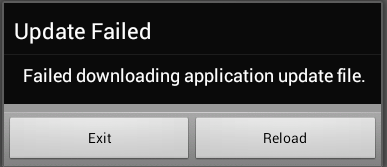

# Building apps and Configuring the Worklight server for use in slow networks.

## Introduction
Despite many advances in wireless network technologies, access to high speed mobile networks is not all pervasive especially in growth markets such as India, Africa and South East Asia. In these markets, the most popular way to access the Internet is through GSM, GPRS or EDGE. These networks have various data transfer rates which are in the order of up to a few hundred kbits per second. In this document, we will refer to such networks as Slow networks.

The aim of this document is to provide a comprehensive set of guidelines and recommendations to optimize user experience on slow networks with respect to:
A. Writing applications designed to be used on slow networks
B. Configuring IBM Worklight
C. Configuring other products commonly used in conjunction with IBM Worklight such as Application servers, proxy & reverse-proxy servers etc.

## Writing IBM Worklight apps with slow networks in mind
When Worklight applications are run on mobile devices that access the server over a slow network, it is important to reduce the amount of data transfer between the device and the server to ensure faster interaction with the user. Even when the amount of data transfer is minimized, it is equally important to keep the user apprised of the estimated time to complete an operation over the network. The following recommendations can be used while building IBM Worklight applications to ensure the aforementioned conditions are satisfied.

### A. Compression
Starting IBM Worklight 6.0, it is possible for IBM Worklight applications to request data in a compressed format in response to invokeProcedure calls. Since data returned by the IBM Worklight server is in JSON format, compressing adapter responses greatly reduces the amount of data transferred and therefore the time taken to complete a response.

The following code snippet demonstrates how to request for a compressed response from the server in case of a Hybrid application.

```JavaScript
var invocationData = {
	adapter : 'adapter-name',
	procedure : 'procedure',
	parameters : [],
	compressResponse : true
};
WL.Client.invokeProcedure(invocationData, options);
```

During laboratory tests, it was found that compressing adapter responses improves the response time by up to **73%** especially for large payloads on slow networks. The following chart shows typical response times with compression turned on and off for various sizes of payload*.

As you can notice from the chart, for data sizes of 500 kilobytes and above, the gap widens and compressing the payload pays good dividends. In addition to reducing the response time, data charges are reduced too.

### B. Configuring adapter timeout

Each invokeProcedure call made by the device is subject to a default timeout of 30 seconds. If your invokeProcedure call expects a large amount of data from the adapter over a slow network, consider increasing the timeout.

```JavaScript
var invocationData = {
	adapter : 'adapter-name',
	procedure : 'procedure-name',
	parameters : [],
	compressResponse : true
};
var ONE_MINUTE = 60 * 1000;
var options = {
	timeout : ONE_MINUTE,
	onSuccess : sucessCallback,
	onFailure : failureCallback
};
WL.Client.invokeProcedure(invocationData, options);
```

The above snippet of code demonstrates how to increase the adapter timeout from the default of 30 seconds to 60 seconds.

The following chart shows typical response times for various payloads*


As you can see from the chart, for payloads of size of approximately 250 KB and above, the data transfer time exceeds the default timeout interval. This necessitates that applications expecting data in this range should adjust the adapter response timeout appropriately.


### C. Response time from the adapter

Another factor influencing invokeProcedure timeout on the device is the actual time taken by the adapter to respond. If your adapter takes a significant amount of time to fetch data from the backend, then this must be factored in the timeout value you set during invokeProcedure. In general, ensure

> (invokeProcedure timeout) >= (Adapter response time) + (Transmission time over the network)


### D. Adapting application behavior to timeouts

Despite the best measures taken, slow networks, by their very nature are unpredictable with respect to speed and reliability. It is therefore recommended that application designers be cognizant of this fact and build resilience to such timeouts within their applications. For example, applications can retry a timed out operation with a larger timeout value. A typical JSON response from the Worklight server when a timeout occurs is given below. This can be accessed in the onFailure callback

```JavaScript
{
	"invocationContext" : null,
	"errorCode" : "REQUEST_TIMEOUT",
	"errorMsg" : "Request timed out for <REQUEST_URL>. Make sure the host address is available to the app (especially relevant for Android and iPhone apps)."
}
```

### E. Direct update considerations

Successful direct updates of applications over slow networks depends on sustained reliability of the mobile network over a large period of time while the update is being downloaded. Frequent loss of signal, network congestion can lead to disrupted and hence failed direct updates.

It is therefore advised to keep the application footprint as small as possible to minimize chances of direct update failure. IBM Worklight sends a compressed version of the update file to the client to minimize data charges as well as to increase chances of a successful direct update over slow networks. Should direct updates fail frequently over slow networks, the end user must be advised to continue the direct update when a better network, such as WiFi is available.

A failure during Direct Update as a result of network troubles will present the user with an error message as shown below




### F. Use of IBM Worklight Application Center (in progress with AppCenter team)

IBM Worklight Application Center provides a mobile client which can be used to download and update applications. Delivering application updates through the Application Center provides the devices with capabilities such as resumable downloads and automatic retry of broken downloads. These features are especially recommended for devices that install and update applications over slow networks.


_Note: The data presented here are experimental values obtained for random JSON data and may change based on various external factors such as network congestion, signal strength and other factors influencing network delays_


## Recommendations for Worklight development

Following are the list of recommendations for IBM Worklight development to ensure Worklight apps are better suited to work on slow networks

1. Chunking of adapter responses - When a response from the adapter is large, the device should have the option of requesting data in a chunked format so that, if a download fails or times out, the client can continue from where it left off. Apart from increasing reliability, this will also reduce data charges when successive retries are made. It is possible to make use of the Range HTTP headers for this purpose.

2. Resumable download of direct update - Currently, if a download during direct update terminates, the application, when launched for the next time, downloads the entire update file from scratch eliciting a high chance of failure on slow networks especially for large apps. To prevent this, direct update must be able to resume a download from the previous position each time an app is launched. Android API provides a Download Manager to achieve this (There are 3rd party libraries for iOS). A prototype implementation is in progress.

3. Selective update of web resources - For hybrid apps, an alternative option is to selectively update only those web resources that have been modified instead of the full package. E.g. If only on .js file has been updated on the server, the direct update must download only the .js file and not other files. This option has wide implications (checksums, platform compatibility etc. ) and these issues must be investigated.

4. Reintroduce option to postpone Direct update - Worklight 5.0.6 allowed users to defer a direct update whereas in Worklight 6.0 onwards, there is no 'Cancel' button when a direct update is presented to the user. Keeping in mind the reasons why this was removed, the cancel button must perhaps be reintroduced.

